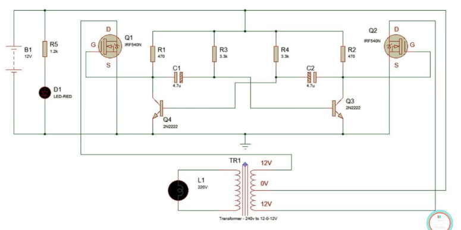
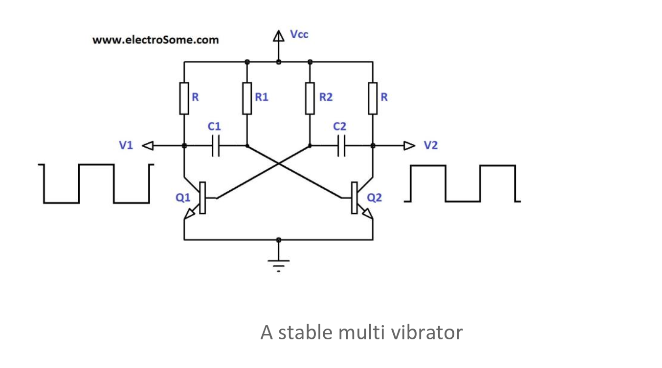
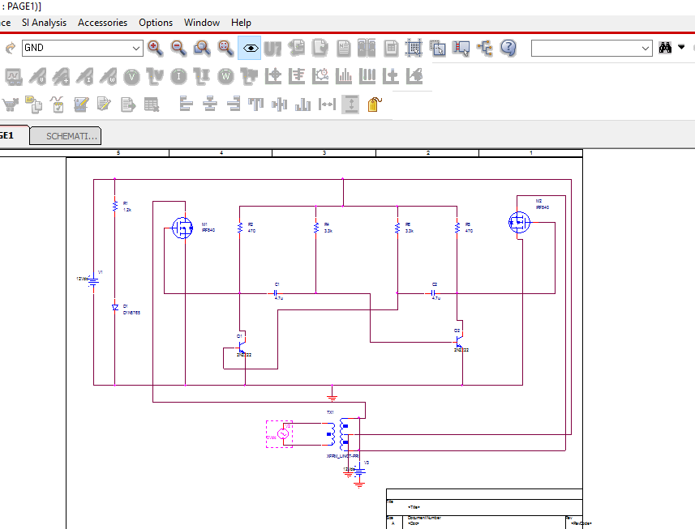

# Astable Multivibrator Inverter Circuit

using MOSFETs, BJTs and Transformer.

# Circuit

The basic idea behind every inverter circuit is to produce oscillations using the given DC and apply these oscillations across the primary of the transformer by amplifying the current. 

The circuit can be divided into three parts: oscillator, amplifier and transformer. A 50Hz oscillator is required as the frequency of AC supply is 50Hz.

# Devices Used

NPN BJTs 2n2222a, IRF840 MOSFETS, 12-0-12 transformer, 4.7 uF Capacitor, Resistances.

# Pspice simulation

